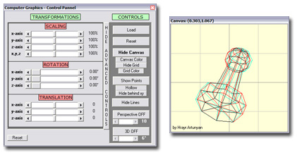



## Graphics 3D  Draw in 3D and manipulate it using the mouse\.

### Description

This program is a complete 3D graphics engine. Excellent Learning Tool. It allows you to define your own 3D shapes in text files and load them. Once the shapes are loaded you may use transformations such as scaling, rotations and translation. There is a 3D view mode that shows an anaglyph of the shape. There is also perspective mode and much much more. Please Vote and ENJOY!!
 
### More Info
 

             |
---                |---
**Submitted On**   |2004-06-03 22:51:28
**By**             |[Hrayr Artunyan](https://github.com/Planet-Source-Code/PSCIndex/blob/master/ByAuthor/hrayr-artunyan.md)
**Level**          |Advanced
**User Rating**    |5.0 (139 globes from 28 users)
**Compatibility**  |VB 4\.0 \(32\-bit\), VB 5\.0, VB 6\.0
**Category**       |[Graphics](https://github.com/Planet-Source-Code/PSCIndex/blob/master/ByCategory/graphics__1-46.md)
**World**          |[Visual Basic](https://github.com/Planet-Source-Code/PSCIndex/blob/master/ByWorld/visual-basic.md)
**Archive File**   |[Graphics\_3175378642004\.zip](https://github.com/Planet-Source-Code/hrayr-artunyan-graphics-3d-draw-in-3d-and-manipulate-it-using-the-mouse__1-54184/archive/master.zip)

